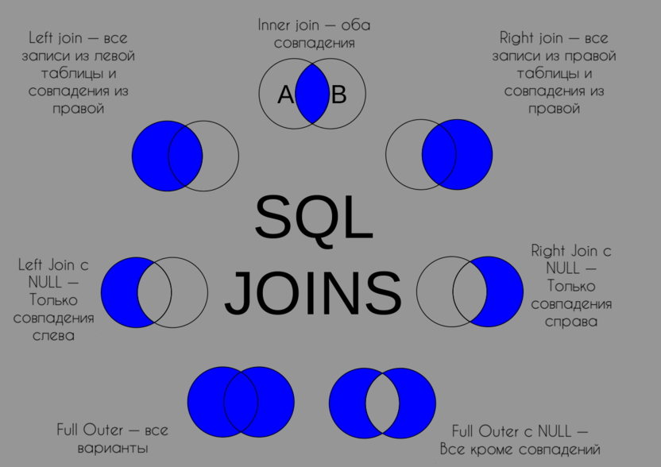

Outer Join – это своего рода противоположность Inner Join. Как понятно из названия, Outer Join предоставляет информацию не только из внутренней части поиска, но и из внешней. То есть программа ищет не только точечные совпадения по выбранным ранее критериям, а позволяет немного ослабить «хватку» и предоставить более «свободные» результаты поиска, включающие в себя элементы из таблиц, которые хоть и совпадают с критериями в SQL-запросе, но не полностью.

Когда такой подход может понадобиться? Например, для скрупулезной фильтрации товаров. Если вы готовы покупать продукцию компании «Шестерочка» и не против, если среди нее окажется молоко, но при этом вы точно не хотите покупать молоко других производителей, то вам подойдет подобный фильтр. Он позволяет дать одному из критериев поиска что-то в духе привилегий. 

Разновидности Outer Join:

Left
Левое объединение подразумевает как раз выше описанный сценарий. Когда мы берем одну таблицу, подключаем вторую и при этом показываем не только точные совпадения, но еще и весь список строк, полученных из левой таблицы, для которых не нашлось пары в правой таблице.

```
SELECT *
FROM table1
LEFT JOIN table2 ON table1.parameter=table2.parameter
```

Right
Понятно, что правое объединение будет работать в обратную сторону и покажет элементы из правой таблицы, для которых не нашлось пары в левой. 

```
SELECT *
FROM table1
RIGHT JOIN table2 ON table1.parameter=table2.parameter
```

Full
Это вариант для тех, кто хочет использовать сразу два разных критерия для поиска какого-либо контента. Снова вернемся к примеру с музыкальным приложением. Join Full может пригодиться, если вы хотите послушать либо что-то на русском, либо любой рэп. Вам не важны какие-либо другие параметры. Вас волнуют исключительно две характеристики. При этом вам не так важно, будут ли они пересекаться. То есть вам все равно, будет рэп на русском или же на русском будет какой-то агрессивный металл.

```
SELECT *
FROM table1
FULL OUTER JOIN table2 ON table1.parameter=table2.parameter
```
